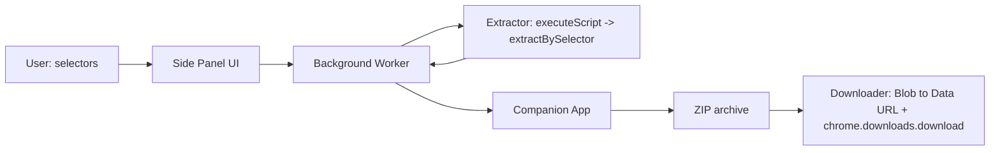
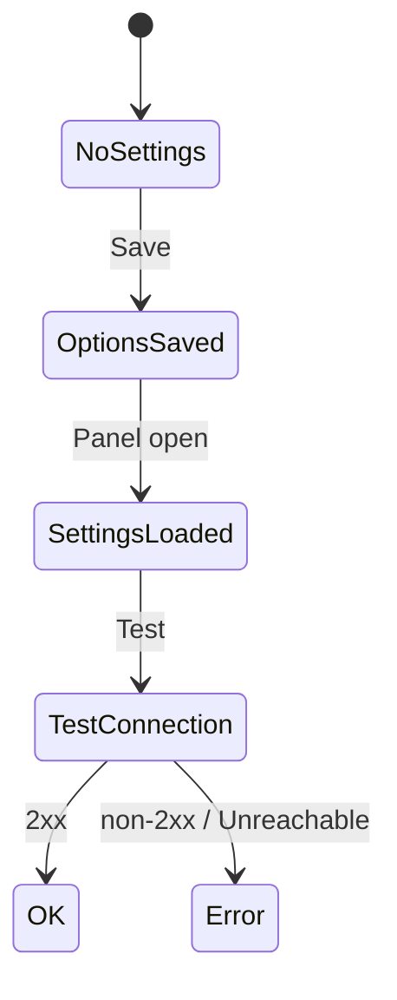

# HTML → Markdown (LLM)

**One-paragraph summary**

Provide an MV3 Chrome extension feature that collects selected parts of a web page and sends the concatenated HTML to a companion application running on the developer's machine (default: `http://localhost:3000`) for conversion to Github-Flavoured Markdown (GFM). The **side panel** UI supports element-picking (hover-to-select), an editable filename pre-filled from the active tab title, and full row editing (select/change/delete) for selectors. Unlike a popup, the side panel stays open while interacting with the page, making the element picker usable without the UI closing. The extension performs extraction and preflight checks (exactly-one match per selector, size guard) and then POSTs the HTML to the companion app, which returns a ZIP archive containing the Markdown and associated assets to be downloaded by the extension.

**Done means:**

1. The side panel shows an editable filename prefilling from the current tab title and a dynamic row list for selectors where each row can be selected via an element picker, edited, or deleted.
2. Each non-empty selector is validated via `chrome.scripting.executeScript` and must match exactly one element; invalid rows show errors and block conversion.
3. Concatenated HTML larger than 200 KB aborts with a clear error.
4. The extension performs a pre-flight health check on the companion app; if unreachable, it aborts and notifies the user via a Toast notification.
5. The extension POSTs the concatenated HTML to a companion app (default companion endpoint: `http://localhost:3000/html-elements-to-markdown`) and downloads the returned ZIP archive (containing Markdown and assets) as a `.zip` file.
6. All final status updates (Success/Error) are delivered via `chrome.notifications` (Toast notifications) to ensure visibility even if the side panel is closed.
7. Options page allows configuring the companion app's URL with a "Test connection" functionality for a small health check request to the companion app.
8. Clicking the extension toolbar icon opens the side panel directly (`chrome.sidePanel.setPanelBehavior({ openPanelOnActionClick: true })`).

---

## Scope & Non-Goals

**In scope:**

- Side panel UI with editable filename (prefilled by slugifying the active tab title) and dynamic selector rows (selector + optional label)
- Element picker / hover-to-select UI injected into the active tab to allow picking elements visually
- Row actions: select another element, edit selector, delete selector
- Extraction via injected `extractBySelector` executed in the active tab
- 200 KB HTML size guard
- Pre-flight health check (`GET /companion-app-connection-test`) before starting extraction
- Send concatenated HTML to companion app (default companion endpoint: `http://localhost:3000/html-elements-to-markdown`) and download the returned ZIP archive
- Download as `.zip` using `chrome.downloads.download({saveAs: true})` via the background service worker
- Status notifications via `chrome.notifications` (Toasts) for success and error states
- Toolbar icon opens side panel directly (no popup intermediary)

**Non-goals:**

- Per-row multi-match mode (each row must match exactly one element)
- Streaming conversion results into the side panel

---

## Architecture

High-level modules:

- `src/background/service-worker.js` — Orchestrator: handles pre-flight, extraction, API POST, and downloads; also sets `chrome.sidePanel.setPanelBehavior({ openPanelOnActionClick: true })` on startup
- `src/core/storage.js` — get/save settings; split sync/local storage
- `src/core/slug.js` — `slugify(text)` utility
- `src/core/extract.js` — injected `extractBySelector(selector)` executed in page context
- `src/app/options/*` — settings UI (companion `baseUrl`, optional model preference, test connection)
- `src/app/sidepanel/*` — selector rows, validation, LLM call, download (replaces the old popup; stays open while interacting with the page)

### End-to-End Conversion Flow (Sequence Diagram)


### Data Flow (Block Diagram)



### Settings Lifecycle (State Diagram)



- This diagram shows the side panel/options lifecycle for extension settings and companion-app health checks.  
- **States:** `NoSettings` → `OptionsSaved` → `SettingsLoaded` → `TestConnection` → `OK` or `Error`.  
- **Transitions:**  
  - Save in Options moves `NoSettings` → `OptionsSaved`.  
  - Opening the side panel loads saved settings → `SettingsLoaded`.  
  - The side panel or Options triggers a health check → `TestConnection`.  
  - Health-check success → `OK` (2xx); failure (unreachable/non-2xx) → `Error`.  
- **Implication:** The diagram models verifying the companion app before conversion and driving UI warnings or error states when the companion is unreachable.

---

## Key Decisions

### Side panel over popup

The extension uses `chrome.sidePanel` instead of `action.default_popup`. Clicking the toolbar icon opens the side panel directly (`chrome.sidePanel.setPanelBehavior({ openPanelOnActionClick: true })`). This avoids the popup closing when the user interacts with the page — essential for the element picker to work without the UI disappearing.

### Filename inference and editability

The side panel pre-fills the filename by inferring it from the active tab title using `slugify(tab.title) + '.md'`. The filename is editable in the side panel; edits are ephemeral (not stored in Options) and used for the current download. There is intentionally no global "default filename" stored in Options.

### Selector strictness

Each selector must match exactly one element. This simplifies author expectations and avoids ambiguous concatenation ordering.

### Storage split

The extension stores the companion app `baseUrl` in `chrome.storage.sync` so settings can sync across the user's Chrome instances.

### Companion-app integration

- Conversion is performed by the user's companion application at the configured `baseUrl` (default `http://localhost:3000`). The background worker POSTs the concatenated HTML to the companion endpoint `POST /html-elements-to-markdown` and expects a ZIP archive containing the Markdown and assets in response. This bypasses cross-origin restrictions with remote LLMs and delegates credential and remote-API management to the local app.
- The Options page will use `GET /companion-app-connection-test` on the configured host to verify reachability.
| `src/background/service-worker.js` | **to be added** | Orchestrator: handles pre-flight health checks, communication between popup and content scripts, performs API POST to companion app, triggers ZIP download, and sends system notifications

### HTML size guard

Abort conversion if concatenated outerHTML exceeds 200 * 1024 bytes to avoid large requests and unexpected billing.

---

## Files Touched

| Path | Change | Note |
|------|--------|------|
| `manifest.json` | **exists** | Extension manifest at repo root; ensure MV3 permissions include `activeTab`, `scripting`, `storage`, `downloads` and `host_permissions` for the companion app. |
| `src/background/service-worker.js` | **to be added** | Orchestrator: handles communication between popup and content scripts, performs API POST to companion app, triggers ZIP download, and sends system notifications |
| `src/core/storage.js` | **to be added** | Settings helper: persist companion `baseUrl` and optional preferences; split `chrome.storage.sync` for non-sensitive settings. |
| `src/core/slug.js` | **to be added** | `slugify(text)` used to infer a safe filename from tab title. |
| `src/content-scripts/extract.js` | **to be added** | Content script injected into the page that implements `extractBySelector(selector)` and returns `{ok,count,html,error}`. |
| `src/app/options/options.html` | **to be added** | Options page markup for configuring the companion `baseUrl` and running the health-check. |
| `src/app/options/options.js` | **to be added** | Options page logic: save settings to `chrome.storage.sync` and call `GET /companion-app-connection-test` for validation. |
| `src/app/sidepanel/sidepanel.html` | **exists** | Side panel markup: editable filename, dynamic selector rows, element-picker controls, Convert button, status area. |
| `src/app/sidepanel/sidepanel.js` | **exists** | Side panel script: row CRUD, validation, trigger content-script picker, send conversion request to background worker, and handle status updates. |
| `src/app/sidepanel/sidepanel.css` | **exists** | Side panel styles (responsive, no fixed width). |
| `src/app/popup/` | **removed** | Old popup files no longer referenced; toolbar icon opens side panel directly. |
| `src/content-scripts/picker.js` | **to be added** | Content script that shows a hover overlay and captures a selector when the user picks an element; communicates selection back to the popup via `chrome.runtime` or `window.postMessage`. |

---

## Implementation Steps

- [ ] Add/validate MV3 `manifest.json` at repo root
  - Ensure `action` (no popup), `side_panel`, `options_page`, `content_scripts` (picker/extract) and permissions: `activeTab`, `scripting`, `storage`, `downloads`, `sidePanel`, and `host_permissions` (e.g., `http://localhost:3000/*`).

- [ ] Implement the conversion flow:
  - Pre-flight health check $\rightarrow$ `executeScript` (extract) $\rightarrow$ `fetch` (POST to companion) $\rightarrow$ `chrome.downloads.download` (ZIP data URL).
  - Integrate `chrome.notifications` for success and error toasts
- [ ] Implement settings storage
  - Create `src/core/storage.js` with `getSettings()` / `saveSettings()` that persists `companionBaseUrl` and preferences to `chrome.storage.sync`.

- [ ] Implement utility helpers
  - Create `src/core/slug.js` with `slugify(text)` to generate safe filenames from tab titles.

- [ ] Implement content scripts
  - `src/content-scripts/extract.js`: expose `extractBySelector(selector)` returning `{ok, count, html?, error?}` (no extension APIs, pure page DOM). Designed for `chrome.scripting.executeScript`.
  - `src/content-scripts/picker.js`: element-picker overlay that highlights elements on hover and sends a selector back to the side panel via `chrome.runtime.sendMessage`.

- [ ] Implement Background Service Worker
  - Create `src/background/service-worker.js` to handle port messages from the side panel.
  - Call `chrome.sidePanel.setPanelBehavior({ openPanelOnActionClick: true })` on startup.
  - Implement the flow: `executeScript` (extract) $\rightarrow$ `fetch` (POST to companion) $\rightarrow$ `chrome.downloads.download` (ZIP data URL).

- [ ] Build Options page
  - Add `src/app/options/options.html` + `src/app/options/options.js` to configure `companionBaseUrl` and run `GET /companion-app-connection-test` (show warning only on failure).

- [ ] Build Side Panel UI and wiring
  - Add `src/app/sidepanel/sidepanel.html`, `sidepanel.css`, and `sidepanel.js` implementing: editable filename input, dynamic selector rows, Add/Remove/Edit row actions, element-picker integration, 200 KB size guard, and communication with the background worker.
  - Implement "Step-by-Step Feedback" UI: display three status indicators (Connection, Extraction, Upload) that turn green on success or red on failure.
  - The side panel stays open after conversion completes (unlike a popup which would close).

- [ ] Remove old popup files
  - Delete `src/app/popup/popup.html`, `src/app/popup/popup.js`, `src/app/popup/popup.css` (no longer referenced).

- [ ] Tests and linting
  - Add small unit tests for `slugify` and `inferFilename` (node-runner) and run a basic static lint/format step.

- [ ] Manual end-to-end verification
  - Load the unpacked extension in `chrome://extensions` and verify: toolbar icon opens side panel, Options health-check, picker, single-row and multi-row flows, size guard behavior, download/save-as.

- [ ] Cleanup
  - Remove any placeholder `manifest` key from `package.json` and ensure packaging/build metadata is correct.

---

## Clarifying Questions & Responses

- Should the Options page warn users explicitly about connectivity expectations for custom `baseUrl`?

  - Behavior: the Options page will only surface a warning if the configured companion host is unreachable or returns a failing health-check. The warning will explain that the companion app must be reachable and that the extension requires `host_permissions` for the configured domain.

- What health-check endpoint should the companion app expose?

  - Use: `GET /companion-app-connection-test` as the canonical health-check endpoint called by the Options page and the popup (as a lightweight reachability test).

> [!TIP]
> By using `host_permissions` in the manifest, the extension bypasses CORS restrictions when communicating with the companion app, simplifying the server-side configuration.

---

## Appendix — Example system/user prompts

**System prompt**

> Convert the following HTML (a sequence of selected elements) to clean, semantic Markdown. Strip scripts, styles, ads, and navigation. Keep each element as a coherent section in the order presented. Output only the Markdown.

**User prompt**

```
```html
${concatenatedHtml}
```

```
