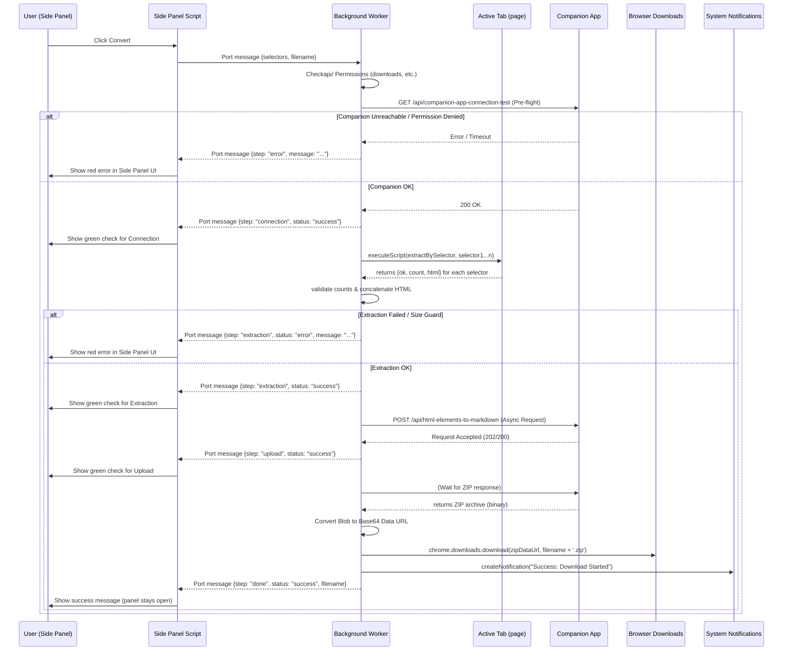
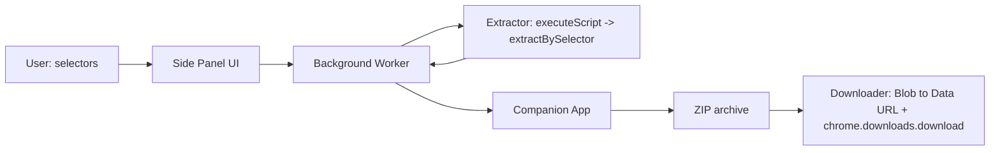
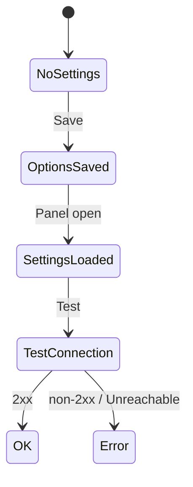

# HTML → Markdown (LLM)

**One-paragraph summary**

Provide an MV3 Chrome extension feature that collects selected parts of a web page and sends the concatenated HTML to a companion application running on the developer's machine (default: `http://localhost:3000`) for conversion to Github-Flavoured Markdown (GFM). The **side panel** UI supports element-picking (hover-to-select), an editable filename pre-filled from the active tab title, and full row editing (select/change/delete) for selectors. Unlike a popup, the side panel stays open while interacting with the page, making the element picker usable without the UI closing. The extension performs extraction and preflight checks (exactly-one match per selector, size guard) and then POSTs the HTML to the companion app, which returns a ZIP archive containing the Markdown and associated assets to be downloaded by the extension.

**Done means:**

1. The side panel shows an editable filename prefilling from the current tab title and a dynamic row list for selectors where each row can be selected via an element picker, edited, or deleted.
2. Each non-empty selector is validated via `chrome.scripting.executeScript` and must match exactly one element; invalid rows show errors and block conversion.
3. Concatenated HTML larger than 200 KB aborts with a clear error.
4. The extension performs a pre-flight health check on the companion app; if unreachable, it aborts and notifies the user via a Toast notification.
5. The extension POSTs the concatenated HTML (as JSON `{ "html": "<concatenated>" }`) to a companion app (endpoint: `POST {baseUrl}/api/html-elements-to-markdown`) and downloads the returned ZIP archive (containing Markdown and assets) as a `.zip` file.
6. All final status updates (Success/Error) are delivered via `chrome.notifications` (Toast notifications) to ensure visibility even if the side panel is closed.
7. Options page allows configuring the companion app's URL with a "Test connection" functionality for a small health check request to the companion app.
8. Clicking the extension toolbar icon opens the side panel directly (`chrome.sidePanel.setPanelBehavior({ openPanelOnActionClick: true })`).

---

## Scope & Non-Goals

**In scope:**

- Side panel UI with editable filename (prefilled by slugifying the active tab title) and dynamic selector rows (selector + optional label)
- Element picker / hover-to-select UI injected into the active tab to allow picking elements visually
- Row actions: select another element, edit selector, delete selector
- Extraction via injected `extractBySelector` executed in the active tab
- 200 KB HTML size guard
- Pre-flight health check (`GET {baseUrl}/api/companion-app-connection-test`, performed by the service worker) before starting extraction
- Send concatenated HTML to companion app (`POST {baseUrl}/api/html-elements-to-markdown`) and download the returned ZIP archive
- Download as `.zip` using `chrome.downloads.download({saveAs: true})` via the background service worker
- Status notifications via `chrome.notifications` (Toasts) for success and error states
- Toolbar icon opens side panel directly (no popup intermediary)

**Non-goals:**

- Per-row multi-match mode (each row must match exactly one element)
- Streaming conversion results into the side panel

---

## Architecture

High-level modules:

- `src/background/service-worker.js` — Orchestrator: handles pre-flight, extraction, API POST, and downloads; also sets `chrome.sidePanel.setPanelBehavior({ openPanelOnActionClick: true })` on startup
- `src/core/storage.js` — get/save settings; `companionBaseUrl` in `chrome.storage.sync`, `lastFilename` in `chrome.storage.local` (currently unused by the UI)
- `src/core/slug.js` — `slugify(text)` utility (UMD-style global so the side panel can load it without a bundler)
- `src/content-scripts/extract.js` — injected on demand (no `content_scripts` manifest entry); attaches `extractBySelector(selector)` to `window.__HTML_TO_MD_EXTRACT`, returns `{ok, count, html, error}`
- `src/content-scripts/picker.js` — injected on demand; renders a hover overlay and sends the captured selector to the side panel via `chrome.runtime.sendMessage({ type: "html-markdown-picker-selection", selector })`
- `src/app/options/*` — settings UI: companion `baseUrl` + "Test connection" health check. No "model preference" field — the LLM model is chosen by the companion app, not the extension.
- `src/app/sidepanel/*` — selector rows, validation, picker trigger, download; uses `chrome.runtime.onMessage` (tab resolve, permission check, picker injection, selector validation) plus a long-lived port (`html-markdown-convert`) for the convert flow; stays open while interacting with the page

### End-to-End Conversion Flow (Sequence Diagram)



### Data Flow (Block Diagram)



### Settings Lifecycle (State Diagram)



- This diagram shows the side panel/options lifecycle for extension settings and companion-app health checks.  
- **States:** `NoSettings` → `OptionsSaved` → `SettingsLoaded` → `TestConnection` → `OK` or `Error`.  
- **Transitions:**  
  - Save in Options moves `NoSettings` → `OptionsSaved`.  
  - Opening the side panel loads saved settings → `SettingsLoaded`.  
  - The side panel or Options triggers a health check → `TestConnection`.  
  - Health-check success → `OK` (2xx); failure (unreachable/non-2xx) → `Error`.  
- **Implication:** The diagram models verifying the companion app before conversion and driving UI warnings or error states when the companion is unreachable.

---

## Key Decisions

### Side panel over popup

The extension uses `chrome.sidePanel` instead of `action.default_popup`. Clicking the toolbar icon opens the side panel directly (`chrome.sidePanel.setPanelBehavior({ openPanelOnActionClick: true })`). This avoids the popup closing when the user interacts with the page — essential for the element picker to work without the UI disappearing.

### Filename inference and editability

The side panel pre-fills the filename by inferring it from the active tab title using `slugify(tab.title) + '.md'`. The filename is editable in the side panel and used (minus its extension) as the base name for the downloaded `<name>.zip`. `inferFilename()` lives inside the side panel IIFE (and is mirrored in `tests/slug.test.js` because it is not yet extracted into a shared module). `storage.js` defines a `lastFilename` field persisted to `chrome.storage.local`, but the side panel currently never writes or reads it, so the filename is effectively ephemeral per session — there is no global default filename honoured by the UI.

### Selector strictness

Each selector must match exactly one element. This simplifies author expectations and avoids ambiguous concatenation ordering.

### Storage split

The extension stores the companion app `baseUrl` in `chrome.storage.sync` so settings can sync across the user's Chrome instances. `lastFilename` is kept in `chrome.storage.local` (see above note on its current non-use).

### Companion-app integration

- Conversion is performed by the user's companion application at the configured `baseUrl` (default `http://localhost:3000`). The background worker POSTs the concatenated HTML (as JSON `{ "html": "<concatenated>" }`) to the companion endpoint `POST {baseUrl}/api/html-elements-to-markdown` and expects a ZIP archive containing the Markdown and assets in response. This bypasses cross-origin restrictions with remote LLMs and delegates credential and remote-API management to the local app.
- The service worker runs the pre-flight health check with `GET {baseUrl}/api/companion-app-connection-test` (5s `AbortSignal.timeout`) before extraction.
- The Options page "Test connection" button runs the same `GET {baseUrl}/api/companion-app-connection-test` health check, so a green Options check now confirms the conversion flow can reach the companion.
- `host_permissions` in the manifest cover `http://localhost/*` and `http://127.0.0.1/*`. For non-local companion URLs (and to inject/extract on the visited page) the extension also declares `optional_host_permissions` for `http://*/*` and `https://*/*` and requests them at runtime via `chrome.permissions.request` (Options requests the specific companion origin on save; the side panel requests broad page permissions before injecting the picker/extract scripts).

### HTML size guard

Abort conversion if concatenated outerHTML exceeds 200 * 1024 bytes to avoid large requests and unexpected billing.

---

## Files Touched

| Path | Change | Note |
|------|--------|------|
| `manifest.json` | **exists** | MV3 manifest; `action` (no popup), `side_panel`, `options_ui`, `background.service_worker`. Permissions: `activeTab`, `scripting`, `storage`, `downloads`, `notifications`, `sidePanel`. `host_permissions`: `http://localhost/*`, `http://127.0.0.1/*`; `optional_host_permissions`: `http://*/*`, `https://*/*`. No `content_scripts` key (picker/extract are injected on demand). |
| `src/background/service-worker.js` | **exists** | Orchestrator. Handles `chrome.runtime.onMessage` (`resolve-tab`, `check-permission`, `inject-picker`, `validate-selector`) and a long-lived port `html-markdown-convert` for the convert flow. Implements pre-flight (`/api/companion-app-connection-test`), `executeScript` extraction, `POST /api/html-elements-to-markdown`, ZIP download, and `chrome.notifications`. Includes a 20s keep-alive heartbeat while awaiting the companion. |
| `src/core/storage.js` | **exists** | Settings helper exposing `getSettings()` / `saveSettings()`. Persists `companionBaseUrl` to `chrome.storage.sync` and `lastFilename` to `chrome.storage.local` (the latter is currently unused by the UI). |
| `src/core/slug.js` | **exists** | `slugify(text)` UMD-style helper (CommonJS + `window.slugify`). |
| `src/content-scripts/extract.js` | **exists** | Injected on demand; attaches `extractBySelector(selector)` to `window.__HTML_TO_MD_EXTRACT`, returns `{ok, count, html, error}` using `outerHTML`. |
| `src/content-scripts/picker.js` | **exists** | Injected on demand; hover overlay + click-to-capture; sends `{type: "html-markdown-picker-selection", selector}` (and `-cancelled` on Esc) to the side panel. |
| `src/app/options/options.html` | **exists** | Options page markup: companion `baseUrl` input, Save, and Test connection. (No model-preference field.) |
| `src/app/options/options.js` | **exists** | Saves `companionBaseUrl`; requests the companion origin permission on save; runs `GET {baseUrl}/api/companion-app-connection-test` for the health check (matching the service-worker pre-flight). |
| `src/app/sidepanel/sidepanel.html` | **exists** | Side panel markup: filename input, dynamic selector rows, Add/Convert, three step indicators (Connection / Extraction / Upload & Download), status area. |
| `src/app/sidepanel/sidepanel.js` | **exists** | Row CRUD + validation, picker trigger, `inferFilename()` (embedded), step UI, port-based convert flow. |
| `src/app/sidepanel/sidepanel.css` | **exists** | Side panel styles (responsive, no fixed width). |

---

## Implementation Steps

- [x] Add/validate MV3 `manifest.json` at repo root
  - `action` (no popup), `side_panel`, `options_ui`, `background.service_worker`. Permissions: `activeTab`, `scripting`, `storage`, `downloads`, `notifications`, `sidePanel`. `host_permissions`: `http://localhost/*`, `http://127.0.0.1/*`; `optional_host_permissions`: `http://*/*`, `https://*/*`. `picker.js`/`extract.js` are **injected on demand** (no `content_scripts` key).

- [x] Implement the conversion flow:
  - Pre-flight `GET {baseUrl}/api/companion-app-connection-test` $\rightarrow$ `executeScript` (extract) $\rightarrow$ `fetch` `POST {baseUrl}/api/html-elements-to-markdown` $\rightarrow$ `chrome.downloads.download` (ZIP data URL).
  - `chrome.notifications` for success/error toasts; a 20s keep-alive heartbeat keeps the MV3 worker alive while awaiting the companion.

- [x] Implement settings storage
  - `src/core/storage.js` with `getSettings()` / `saveSettings()`; `companionBaseUrl` to `chrome.storage.sync`, `lastFilename` to `chrome.storage.local` (currently unused).

- [x] Implement utility helpers
  - `src/core/slug.js` with `slugify(text)`; UMD-style so it can be unit-tested under Node and loaded by the side panel.

- [x] Implement content scripts (injected on demand)
  - `src/content-scripts/extract.js`: attaches `extractBySelector(selector)` to `window.__HTML_TO_MD_EXTRACT`, returns `{ok, count, html, error}` from `outerHTML`.
  - `src/content-scripts/picker.js`: hover overlay; on click builds a heuristic CSS selector and sends `chrome.runtime.sendMessage({ type: "html-markdown-picker-selection", selector })`.

- [x] Implement Background Service Worker
  - `src/background/service-worker.js`: `chrome.runtime.onMessage` for `resolve-tab` / `check-permission` / `inject-picker` / `validate-selector`; a long-lived port `html-markdown-convert` for the convert flow.
  - `chrome.sidePanel.setPanelBehavior({ openPanelOnActionClick: true })` on startup (wrapped in try/catch).

- [x] Build Options page
  - `src/app/options/options.html` + `options.js`: configure `companionBaseUrl`, request the companion origin permission on save, run `GET {baseUrl}/api/companion-app-connection-test` (matching the service-worker pre-flight). No model-preference field.

- [x] Build Side Panel UI and wiring
  - `src/app/sidepanel/*`: editable filename (`slugify(title)+'.md'`), dynamic selector rows (Add/Remove/Change), picker integration, 200 KB size guard, and three step indicators (Connection / Extraction / Upload & Download). `inferFilename()` is embedded in the side-panel IIFE.
  - The side panel stays open after conversion (no popup).

- [x] No popup files
  - The final version never used a popup; the toolbar opens the side panel directly, so there was nothing to delete.

- [x] Tests and linting
  - `tests/slug.test.js` covers `slugify` and a mirrored `inferFilename`. `npm test` (`node --test`), `npm run lint` (`eslint`), `npm run format` (`prettier`). No build step.

- [x] Manual end-to-end verification
  - Loaded unpacked in `chrome://extensions`: toolbar opens side panel, Options health-check, picker, single/multi-row flows, size-guard, download/save-as. (Plasmo prototype toolchain removed — see Deviations.)

- [x] Cleanup
  - `package.json` has no build/packaging metadata (only `echo` placeholders for `dev`/`build`/`package`); no Plasmo/`bpp`/`pnpm` traces remain in the repo.

---

## Clarifying Questions & Responses

- Should the Options page warn users explicitly about connectivity expectations for custom `baseUrl`?

  - Behavior: the Options page will only surface a warning if the configured companion host is unreachable or returns a failing health-check. The warning will explain that the companion app must be reachable and that the extension requires `host_permissions` for the configured domain.

- What health-check endpoint should the companion app expose?

  - The service worker uses `GET {baseUrl}/api/companion-app-connection-test` for its pre-flight check. The Options page "Test connection" now calls the same `GET {baseUrl}/api/companion-app-connection-test` endpoint, so a green Options health check confirms the conversion flow can reach the companion.

> [!TIP]
> By using `host_permissions` in the manifest, the extension bypasses CORS restrictions when communicating with the companion app, simplifying the server-side configuration.

---

## Appendix — Example system/user prompts

Deviations from the original plan

During implementation, several details diverged from this plan (mostly driven by MV3 runtime constraints and by removing the Plasmo prototype toolchain). They are captured here so the doc matches the shipped code:

- **Companion endpoints use an `/api` prefix.** The service worker calls `POST {baseUrl}/api/html-elements-to-markdown` and `GET {baseUrl}/api/companion-app-connection-test`; the Options "Test connection" button uses the same `GET {baseUrl}/api/companion-app-connection-test` endpoint. The original plan text omitted the `/api` segment from the Options page and connection-test description.
- **Options "Test connection" endpoint mismatch (resolved).** `options.js` previously called `GET {baseUrl}/companion-app-connection-test` (no `/api`), so a green Options health check did not prove the conversion flow could reach the companion. This was reconciled so Options now uses the same `/api/companion-app-connection-test` path as the service worker (the authoritative flow).
- **Content scripts are injected on demand, not declared in the manifest.** `extract.js` and `picker.js` are loaded via `chrome.scripting.executeScript({ files: [...] })`, so there is no `content_scripts` key in `manifest.json`. This avoids running them on every page.
- **Host permissions are broadened and requested at runtime.** The manifest grants `host_permissions` for `http://localhost/*` and `http://127.0.0.1/*` plus `optional_host_permissions` for `http://*/*` and `https://*/*`. The Options page requests the specific companion origin on save; the side panel requests broad page permissions before injecting the picker/extract scripts (`sendWithPermissionRetry`).
- **Service-worker keep-alive heartbeat.** MV3 workers are killed after ~30s of inactivity; a pending `fetch` does not count as activity. The service worker writes to `chrome.storage.local` every 20s while awaiting the companion response to stay alive.
- **No "model preference" in Options.** The LLM model is chosen by the companion app; the extension only sends HTML. (The plan listed an optional model preference; it was dropped.)
- **`inferFilename` is not a shared module.** It lives inside the side-panel IIFE and is mirrored in `tests/slug.test.js`. The test comment flags extracting it to e.g. `src/core/filename.js` as the canonical fix.
- **`lastFilename` in storage is vestigial.** `storage.js` persists `lastFilename` to `chrome.storage.local`, but the UI never writes or reads it (the side panel always infers from the tab title), so it has no effect.
- **Messaging uses both `chrome.runtime.onMessage` and a long-lived port.** Tab resolution (`resolve-tab`), permission checks (`check-permission`), picker injection (`inject-picker`) and selector validation (`validate-selector`) travel over `onMessage`; the convert flow uses a port named `html-markdown-convert` that streams `connection` / `extraction` / `upload` / `done` / `error` steps. Picker selections are sent from the content script straight to the side panel via `chrome.runtime.sendMessage`.
- **No build step.** The repo has no bundler (the Plasmo prototype toolchain was removed); `package.json` scripts are `echo` placeholders for `dev`/`build`/`package`. Real tooling is `node --test` (tests), `eslint` (lint), and `prettier` (format).
- **Picker builds a custom heuristic selector.** Rather than a guaranteed-unique selector, `picker.js` walks up to 10 ancestors building `tag#id` / `tag:nth-child(n)` / `tag.class1.class2` segments, stopping at an `id`. This is usually sufficient but can be brittle on dynamically generated pages.

---

##

**System prompt**

> Convert the following HTML (a sequence of selected elements) to clean, semantic Markdown. Strip scripts, styles, ads, and navigation. Keep each element as a coherent section in the order presented. Output only the Markdown.

**User prompt**

```
```html
${concatenatedHtml}
```

```
