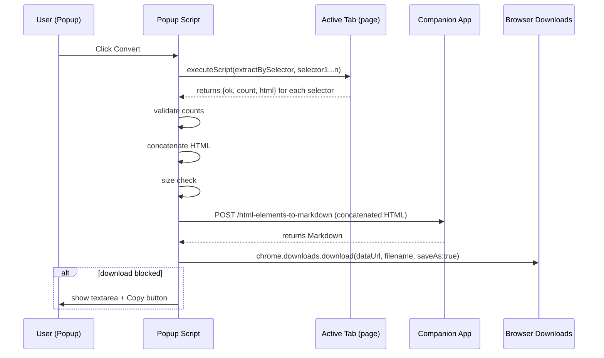
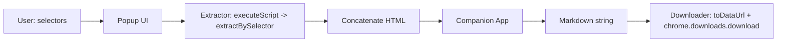
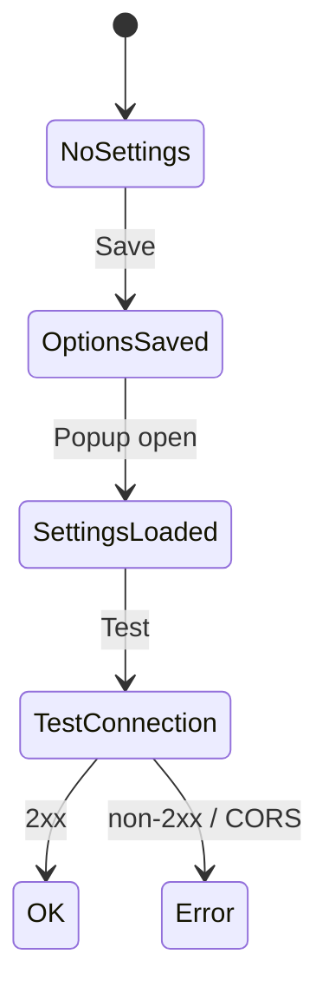

# HTML → Markdown (LLM)

One-paragraph summary

Provide an MV3 Chrome extension feature that collects selected parts of a web page and sends the concatenated HTML to a companion application running on the developer's machine (default: `http://localhost:3000`) for conversion to Github-Flavoured Markdown (GFM). The popup UI supports element-picking (hover-to-select), an editable filename pre-filled from the active tab title, and full row editing (select/change/delete) for selectors. The extension performs extraction and preflight checks (exactly-one match per selector, size guard) and then POSTs the HTML to the companion app, which returns Markdown to be downloaded by the extension.

**Done means:**

1. The popup shows an editable filename prefilling from the current tab title and a dynamic row list for selectors where each row can be selected via an element picker, edited, or deleted.
2. Each non-empty selector is validated via `chrome.scripting.executeScript` and must match exactly one element; invalid rows show errors and block conversion.
3. Concatenated HTML larger than 200 KB aborts with a clear error.
4. The extension POSTs the concatenated HTML to a companion app (default companion endpoint: `http://localhost:3000/html-elements-to-markdown`) and downloads the returned Markdown as a `.md` file; if `chrome.downloads.download` is blocked, the popup offers a textarea + copy button fallback.
5. Options page allows configuring the companion app's URL with a "Test connection" functionality for a small health check request to the companion app.

---

## Scope & Non-Goals

**In scope:**
- Popup UI with editable filename (prefilled by slugifying the active tab title) and dynamic selector rows (selector + optional label)
- Element picker / hover-to-select UI injected into the active tab to allow picking elements visually
- Row actions: select another element, edit selector, delete selector
- Extraction via injected `extractBySelector` executed in the active tab
- 200 KB HTML size guard
- Send concatenated HTML to companion app (default companion endpoint: `http://localhost:3000/html-elements-to-markdown`) and download the returned Markdown
- Download as `.md` using `chrome.downloads.download({saveAs: true})` with a textarea fallback


**Non-goals:**
- Per-row multi-match mode (each row must match exactly one element)
- Streaming conversion results into the popup
- Routing conversion via the extension's service worker (the popup will POST directly to the companion app)

---

## Architecture

High-level modules:

- `src/core/storage.js` — get/save settings; split sync/local storage
-- `src/core/slug.js` — `slugify(text)` utility
-- `src/app/popup/markdown.js` — download helper used by the popup to create a data URL and call `chrome.downloads.download` (contains `toDataUrl` and download orchestration)
- `src/core/extract.js` — injected `extractBySelector(selector)` executed in page context
- `src/app/options/*` — settings UI (companion `baseUrl`, optional model preference, test connection)
- `src/app/popup/*` — selector rows, validation, LLM call, download

### End-to-End Conversion Flow (Sequence Diagram)



### Data Flow (Block Diagram)



### Settings Lifecycle (State Diagram)




- This diagram shows the popup/options lifecycle for extension settings and companion-app health checks.  
- **States:** `NoSettings` → `OptionsSaved` → `SettingsLoaded` → `TestConnection` → `OK` or `Error`.  
- **Transitions:**  
  - Save in Options moves `NoSettings` → `OptionsSaved`.  
  - Opening the popup loads saved settings → `SettingsLoaded`.  
  - The popup or Options triggers a health check → `TestConnection`.  
  - Health-check success → `OK` (2xx); failure (unreachable/CORS/non-2xx) → `Error`.  
- **Implication:** The diagram models verifying the companion app before conversion and driving UI warnings or error states when the companion is unreachable.

---

## Key Decisions

### Filename inference and editability

The popup pre-fills the filename by inferring it from the active tab title using `slugify(tab.title) + '.md'`. The filename is editable in the popup; edits are ephemeral (not stored in Options) and used for the current download. There is intentionally no global "default filename" stored in Options.

### Selector strictness

Each selector must match exactly one element. This simplifies author expectations and avoids ambiguous concatenation ordering.

### Storage split

The extension stores the companion app `baseUrl` in `chrome.storage.sync` so settings can sync across the user's Chrome instances.

### Companion-app integration

- Conversion is performed by the user's companion application at the configured `baseUrl` (default `http://localhost:3000`). The popup POSTs the concatenated HTML to the companion endpoint `POST /html-elements-to-markdown` and expects the converted Markdown version in response. This bypasses cross-origin restrictions with remote LLMs and delegates credential and remote-API management to the local app. 
- The Options page will use `GET /companion-app-connection-test` on the configured host to verify reachability.

### HTML size guard

Abort conversion if concatenated outerHTML exceeds 200 * 1024 bytes to avoid large requests and unexpected billing.

---

## Files Touched

| Path | Change | Note |
|------|--------|------|
| `manifest.json` | **exists** | Extension manifest at repo root; ensure MV3 permissions include `activeTab`, `scripting`, `storage`, `downloads`.
| `src/core/storage.js` | **to be added** | Settings helper: persist companion `baseUrl` and optional preferences; split `chrome.storage.sync` for non-sensitive settings.
| `src/app/popup/markdown.js` | **to be added** | Download helper that lives with the popup code; exports `toDataUrl(md)` and `downloadMarkdown(md, filename)` and contains `inferFilename()` used by the popup.
| `src/core/slug.js` | **to be added** | `slugify(text)` used to infer a safe filename from tab title.
| `src/content-scripts/extract.js` | **to be added** | Content script injected into the page that implements `extractBySelector(selector)` and returns `{ok,count,html,error}`.
| `src/app/options/options.html` | **to be added** | Options page markup for configuring the companion `baseUrl` and running the health-check.
| `src/app/options/options.js` | **to be added** | Options page logic: save settings to `chrome.storage.sync` and call `GET /companion-app-connection-test` for validation.
| `src/app/popup/popup.html` | **to be added** | Popup markup: editable filename, dynamic selector rows, element-picker controls, Convert button, status area.
| `src/app/popup/popup.js` | **to be added** | Popup script: row CRUD, validation, trigger content-script picker/extract, POST to companion endpoint, download fallback UI.
| `src/content-scripts/picker.js` | **to be added** | Content script that shows a hover overlay and captures a selector when the user picks an element; communicates selection back to the popup via `chrome.runtime` or `window.postMessage`.

---

## Implementation Steps

- [ ] Add/validate MV3 `manifest.json` at repo root
  - Ensure `action` (popup), `options_page`, `content_scripts` (picker/extract) and permissions: `activeTab`, `scripting`, `storage`, `downloads`.

- [ ] Implement settings storage
  - Create `src/core/storage.js` with `getSettings()` / `saveSettings()` that persists `companionBaseUrl` and preferences to `chrome.storage.sync`.

- [ ] Implement utility helpers
  - Create `src/core/slug.js` with a robust `slugify(text)`.
  - Keep `inferFilename(tabTitle)` as a small helper inside `src/app/popup/markdown.js` (popup-local function).

- [ ] Implement popup download helper
  - Add `src/app/popup/markdown.js` exporting `toDataUrl(md)` and `downloadMarkdown(md, filename)` which calls `chrome.downloads.download` and implements the textarea fallback.

- [ ] Implement content scripts
  - `src/content-scripts/extract.js`: expose `extractBySelector(selector)` returning `{ok, count, html?, error?}` (no extension APIs, pure page DOM). Designed for `chrome.scripting.executeScript`.
  - `src/content-scripts/picker.js`: element-picker overlay that highlights elements on hover and sends a selector back to the popup via `chrome.runtime.sendMessage`.

- [ ] Build Options page
  - Add `src/app/options/options.html` + `src/app/options/options.js` to configure `companionBaseUrl` and run `GET /companion-app-connection-test` (show warning only on failure).

- [ ] Build Popup UI and wiring
  - Add `src/app/popup/popup.html` and `src/app/popup/popup.js` implementing: editable filename input, dynamic selector rows, Add/Remove/Edit row actions, element-picker integration, per-row validation via `chrome.scripting.executeScript` calling `extractBySelector`, 200 KB size guard, POST to `${companionBaseUrl}/html-elements-to-markdown`, and download handling.

- [ ] Tests and linting
  - Add small unit tests for `slugify` and `inferFilename` (node-runner) and run a basic static lint/format step.

- [ ] Manual end-to-end verification
  - Load the unpacked extension in `chrome://extensions` and verify Options health-check, picker, single-row and multi-row flows, size guard behavior, download/save-as, and textarea fallback.

- [ ] Cleanup
  - Remove any placeholder `manifest` key from `package.json` and ensure packaging/build metadata is correct.

---

## Clarifying Questions & Responses

- Should the Options page warn users explicitly about CORS expectations for custom `baseUrl`?

  - Behavior: the Options page will only surface a warning if the configured companion host is unreachable or returns a failing health-check. The warning will explain that the companion app must accept requests from `http://localhost` origins and recommend checking CORS if remote hosts are used.

- What health-check endpoint should the companion app expose?

  - Use: `GET /companion-app-connection-test` as the canonical health-check endpoint called by the Options page and the popup (as a lightweight reachability test).

> [!TIP]
> Posting to `http://localhost:3000` typically avoids remote-CORS issues if the companion app sets permissive CORS for `http://localhost` origins. The companion app would manage credentials and remote LLM access.

---

## Appendix — Example system/user prompts

**System prompt**

> Convert the following HTML (a sequence of selected elements) to clean, semantic Markdown. Strip scripts, styles, ads, and navigation. Keep each element as a coherent section in the order presented. Output only the Markdown.

**User prompt**

```
```html
${concatenatedHtml}
```
```
